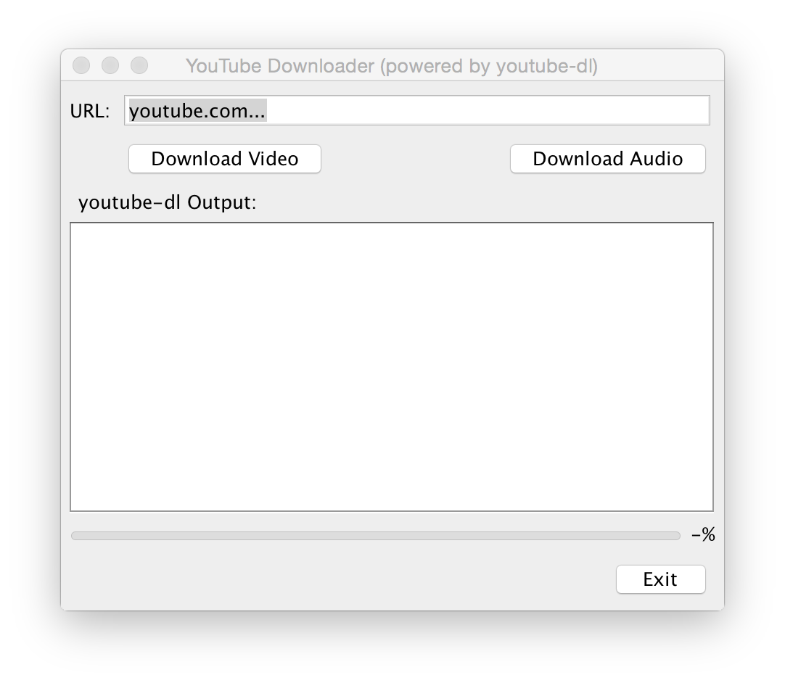
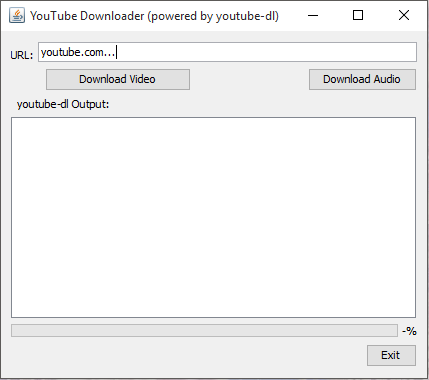

#YdlGUI
A simple interface for youtube-dl.  
Intended for those who fear the shell and those who don't wish to be confronted by all the glorious power of the mighty youtube-dl, yet wish to use it all the same.

supports all youtube-dl parameters. Simply append them to the URL as you would on the commandline.

</img>
</img>
